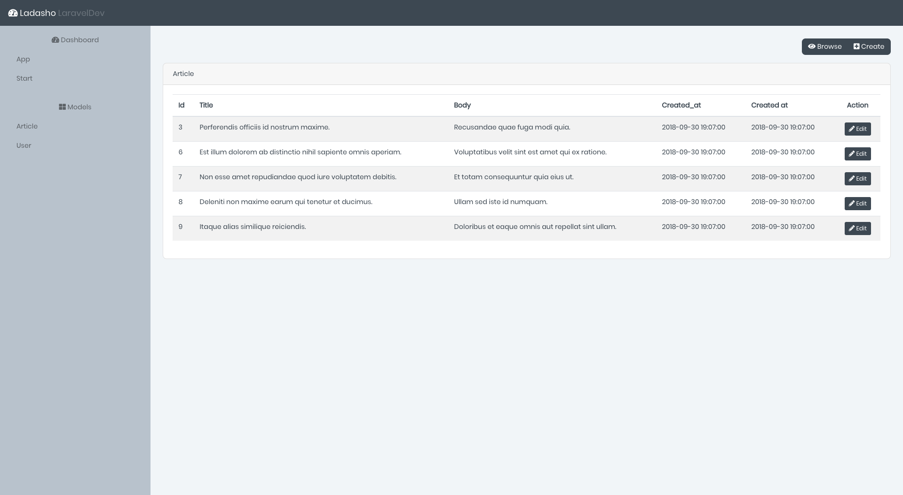

# Ladasho-App
> Tiny Resource Manager for Laravel



Make sure that you have those packages installed in Laravel project:

* [Restpal](https://github.com/damianbal/restpal)
* [Ladasho](https://github.com/damianbal/ladasho)
* [laravel-cors](https://github.com/barryvdh/laravel-cors)

You need to have laravel/passport package installed as well.

## Installation

Clone or download then run those commands

```sh
npm install
npm run serve # or build
```

## Meta

Damian Balandowski – balandowski@icloud.com
